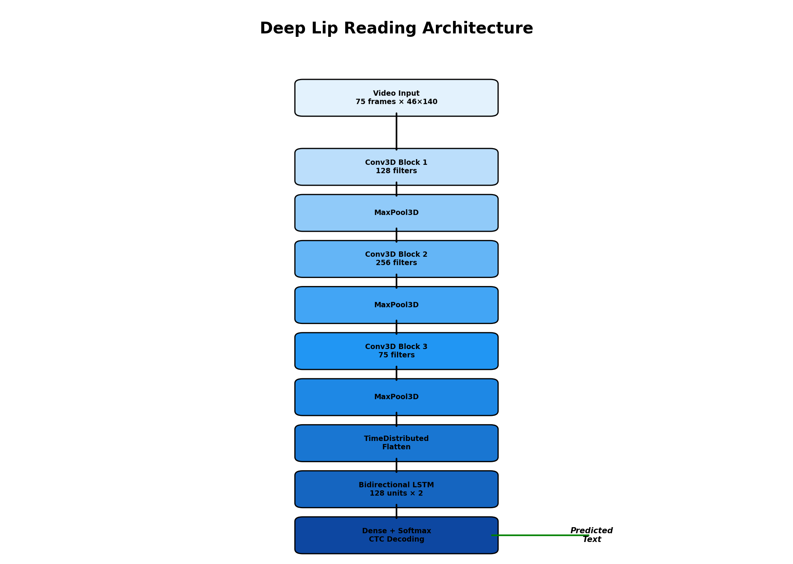

# GitHub Repository Setup Guide

## Fill Out the "About" Section

On your GitHub repository page (https://github.com/zaydabash/deeplip), click the gear icon next to "About" and fill in:

### Description
```
Deep learning lip-reading model using Conv3D + BiLSTM + CTC architecture. Transcribes speech from mouth region video clips for accessibility applications.
```

### Website (Optional)
Leave blank or add your portfolio/demo URL if you have one.

### Topics (Tags)
Add these topics to help others discover your project:
```
deep-learning
lip-reading
tensorflow
keras
conv3d
lstm
ctc
accessibility
computer-vision
video-processing
speech-recognition
```

### How to Add Topics
1. Click the gear icon next to "About"
2. In the "Topics" field, type each topic and press Enter
3. Add all topics listed above
4. Click "Save changes"

## Adding a Repository Image/Banner

### Option 1: Add Image to README (Recommended)

1. **Create or find an image**:
   - Architecture diagram
   - Example output visualization
   - Project logo/banner
   - Size: 1200x630px works well for social sharing

2. **Upload to repository**:
   - Create a `docs/` or `assets/` folder
   - Upload your image (e.g., `architecture.png` or `banner.png`)
   - Commit and push

3. **Add to README**:
   ```markdown
   
   ```

### Option 2: Use Social Preview Image

GitHub automatically uses the first image in your README as the social preview. Add an image at the top of your README:

```markdown
<div align="center">
  
</div>
```

### Option 3: Create a Simple ASCII/Text Banner

Already added to README! The badges and visual architecture diagram serve as visual elements.

## Quick Setup Checklist

- [ ] Fill out repository description
- [ ] Add topics/tags (5-10 relevant tags)
- [ ] Add image to README (optional but recommended)
- [ ] Verify README displays correctly
- [ ] Check social preview (share link to see how it looks)

## Example Complete About Section

**Description:**
```
Deep learning lip-reading model using Conv3D + BiLSTM + CTC architecture. Transcribes speech from mouth region video clips for accessibility applications.
```

**Topics:**
- deep-learning
- lip-reading
- tensorflow
- keras
- conv3d
- lstm
- ctc
- accessibility
- computer-vision
- video-processing

## Social Media Preview

After adding an image to your README, GitHub will automatically use it when sharing your repository on social media. Test by sharing the repository link on Twitter/LinkedIn.

